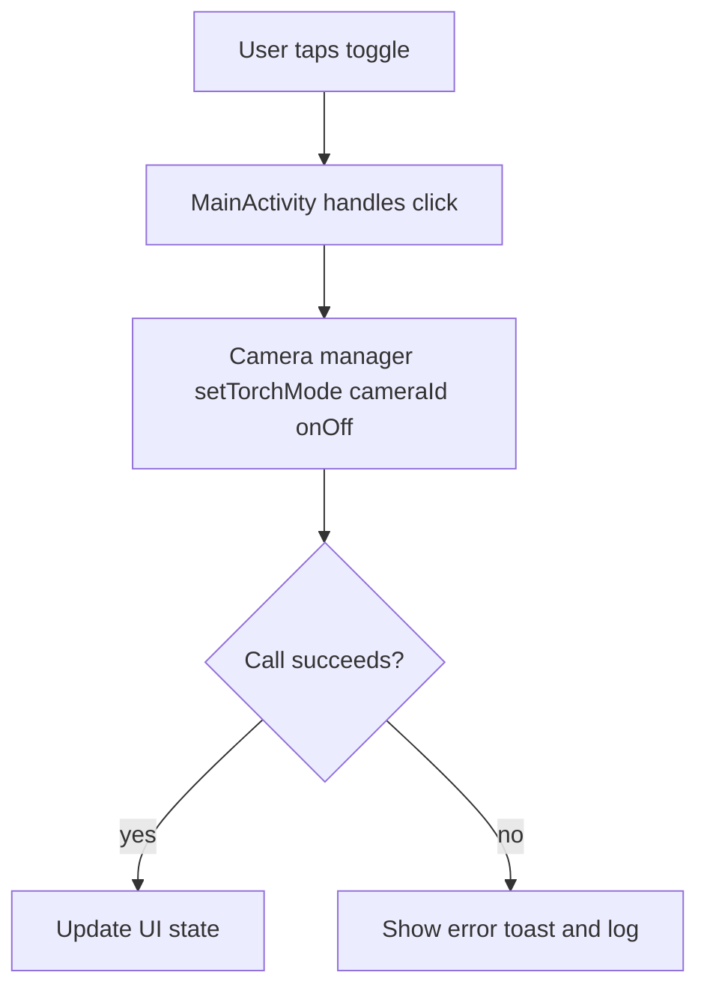

# Android TorchApp 🔦

A minimal Android flashlight (torch) app built in **Java**. It toggles the device’s camera flash using `CameraManager` with a simple, responsive UI—great as a starter for sensor/control demos or coursework.

> Repo snapshot: Java-based Android project layout (`app/`, Gradle wrapper, etc.).  

---

## ✨ Features

- **One-tap flashlight toggle** (uses `CameraManager.setTorchMode`)
- **State-aware UI** (reflects ON/OFF status)
- **Lifecycle-safe** (releases resources appropriately)
- **Lightweight** (no ads, no extras)

---

## 🧱 Tech Stack

- **Language:** Java  
- **UI:** Android Views (or minimal Compose interop depending on template)  
- **API:** `CameraManager` (`android.hardware.camera2`)  
- **Build:** Gradle / Android Studio

---

## 📲 Requirements

- **Android Studio** Giraffe+ (or latest stable)
- **Android SDK** 21+ (Lollipop) recommended  
- A device with **camera flash** (physical device preferred)

---

## 🔐 Permissions

Add the following to `AndroidManifest.xml`:

```xml
<uses-permission android:name="android.permission.CAMERA" />
<uses-permission android:name="android.permission.FLASHLIGHT" />
```
## Run Locally

1. **Clone and open**
   ```bash
   git clone https://github.com/ananya101001/Android--TorchApp.git
   cd Android--TorchApp

## ⚙️ Core Implementation (High Level)
## 🔄 Application Flow

The TorchApp works in a simple, event-driven flow:

1. **User Interaction**  
   - The user taps the **toggle button** on the app UI.

2. **MainActivity Handling**  
   - `MainActivity` receives the click event.  
   - It checks for necessary **permissions** (Camera/Flashlight).  

3. **CameraManager Call**  
   - If permissions are granted, `CameraManager.setTorchMode(cameraId, onOff)` is called.  
   - The `cameraId` corresponds to the back camera that supports flash.

4. **Torch State Change**  
   - The call attempts to switch the flashlight **ON** or **OFF** depending on the toggle state.  

5. **Result Handling**  
   - **Success**: The UI updates to reflect the new torch state (ON/OFF).  
   - **Failure**: An error message (Toast/log) is shown to the user.  

6. **Lifecycle Safety**  
   - If the app goes into the background or is paused, it can optionally turn off the torch to conserve resources.  





